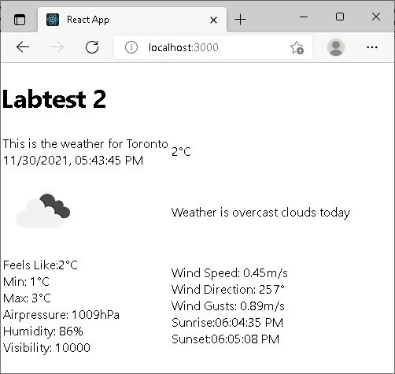

This labtest was completed by following the requirements laid out in the COMP3123_Lab_Test_2.docx document.

As such, I perform an axios call to  6.	Use following end point to get weather data 
http://api.openweathermap.org/data/2.5/weather?q=Toronto&appid={{APIkey}}

using my own APIkey 3add370fd80bfd123c70f9038b4169da

As this is the endpoint mandated by the assignment document, and the labtest document has no requirements for a search or selection of any kind this is done automatically as soon as the application starts and is effectively the endpoint of the application, although refreshing the page will perform a fresh call.

If this application fails to meet your expectations in some way aside from the css styling, the fault lies entirely with the document for failing to explain the requirements
